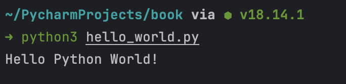

# 1. 시작하기

```python
>>> print("Hello!")
Hello
```

여기에서 `>>>` 는 **파이썬 프롬프트**라고 부름 (= 터미널에서 실행하는 것)

종료하는 방법은 `Ctrl + D` || `exit()` 명령어를 사용하면 됨

```python
# hello_world.py
print("Hello Python World!")
```

