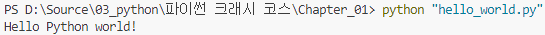

# 1. 시작하기
컴퓨터에 파이썬을 설치하고 첫번째 프로그램을 실행해
Hello World! 메시지를 화면에 출력합니다.

## 파이썬 프롬프트
```python
>>> print("Hello Python interpreter!")
Hello Python interpreter!
```
`>>>` 는 **파이썬 프롬프트**라고 부릅니다.<br>
**프롬프트(prompt)** 란 컴퓨터 시스템에서 사용자의 명령을 받아들일 준비가 되었다고 알려주는 기본 메시지 입니다.<br>
따라서, 위와 같은 예제를 **파이썬 프롬프트**를 통해 입력하였을 때 출력 결과를 얻을 수 있습니다.

## 터미널에서 파이썬 프로그램 실행하기
```python
print("Hello Python world!")
```
