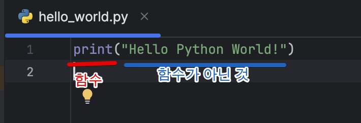

# 2. 변수와 단순한 데이터 타입

# 1. hello_world.py를 실행할 때 일어나는 일

```python
# hello_world.py
print("Hello Python World!")
```

위 코드를 실행하면 어떤 일이 일어날까?

1. 에디터가 파이썬 인터프리터를 실행함
2. 파이썬 인터프리터가 프로그램을 읽고 프로그램의 각 단어가 어떤 의미인지 파악함
    - `print` / `"Hello Python World!"` 을 `출력` / `"Hello Python World!"` 로 파악하고 보여줌.
    

코드를 작성하는 동안에는 어떤 일이 일어날까?

- 함수 이름을 작성하면 인식하고 눈에 띄는 색깔로 표시
- 그 외에는 함수와 다른 색깔로 표시



이를 “**문법 강조**”라고 한다.

# 2. 변수

```python
# hello_world.py
message = "Hello Python World!"
print(message)
```

⇒ 그 전과 같은 결과가 출력됨.

왜? message라는 **변수**에 "Hello Python World!" 라는 문자열을 집어 넣었기 때문

```python
# hello_world.py
message = "Hello Python World!"
print(message)

message = "Hello Python World!2"
print(message)
```

```python
# result
Hello Python World!
Hello Python World!2
```

변수의 값은 언제든 바꿀 수 있고, 파이썬은 현재 값 기준으로 추적함.

### 이름 짓기 및 사용하기

✓ 문자, 숫자, 밑줄만 사용 가능

✓ 맨 앞에는 문자, 밑줄만 사용 가능 (숫자는 X)

✓ 공백 허용하지 않음

✓ 키워드, 내장 함수 이름을 변수 이름으로 사용할 수 없음 ([참고1](https://docs.python.org/ko/3/library/functions.html), [참고2](https://realpython.com/python-keywords/))

✓ 짧고 분명하게

✓ l, 1 / O, 0 혼동하지 않게 주의

✓ 소문자만 사용

### 에러가 발생했을 때

traceback을 통해 문제를 파악한다.

```python
# traceback.py
message = "Hello Python World!"
print(messag)
```


**2번 라인에서 / ‘messsag’ 라는 변수명은 올바르지 않다는 에러가 났다**는걸 파악할 수 있다.

📌 **연습 문제!**

```python
# quiz.py
# 2-1 단순한 메시지
message = "Heelo"
print(message)

# 2-2 단순한 메세지들
message = "Hello"
print(message)

message = "Python"
print(message)
```

# 3. 문자열

문자열은 **연속적인 문자**를 의미한다.

```python
"큰 따옴표 안에 묶기도", 
'작은 따옴표 안에 묶기도 한다.'
'이렇게 "사용"할 수도 있다.'
"이렇게도 '사용'할 수 있다."
```

### 문자열을 사용하는 몇 가지 방법

- **대소문자 변경**

`title()` : 문자열의 각 단어 첫 글자를 대문자로 변경

`upper()` : 문자열 전체를 대문자로 변경

`lower()` : 문자열 전체를 소문자로 변경

```python
# string.py
name = "ada lovelace"
print(name.title())
print(name.upper())
print(name.lower())
```

위 메서드를 실행하면 나오는 결과는 아래와 같다.

```python
Ada Lovelace
ADA LOVELACE
ada lovelace
```

- **문자열 안에서 변수 사용**

따옴표 바로 앞에 `f`를 쓰고(format) 변수를 사용할 때는 `{}`로 묶음

→ 이것을 f-문자열(f-strings)이라고 함. 

```python
# string.py
first_name = "ada"
last_name = "lovelace"
full_name = f"{first_name} {last_name}"
print(f"Hello, {full_name.title()}!")
```

위 메서드를 실행하면 나오는 결과는 아래와 같다.

```python
Hello, Ada Lovelace!
```

아래 코드와 같이 변수에 f-strings를 조합할 수도 있다.

```python
message = f"Hello, {full_name.title()}!"
print(message)
```

- **탭이나 줄바꿈으로 문자열에 공백 추가하기**

탭은 `\t` 를, 줄바꿈은 `\n`을 사용한다.

만약 “먼저 줄바꿈을 하고 탭을 입력하라” 라는 조건을 만족하고 싶으면 `\n\t`를 사용하면 된다.

```python
# string.py
print("Python")
print("\tPython")
print("Languages:\nPython\nC\nJavaScript")
```

위 메서드를 실행하면 나오는 결과는 아래와 같다.

```python
Python
	Python
Languages:
Python
C
JavaScript
```

- **공백 없애기**

`rstrip()` : 문자열 오른쪽에 있는 공백 제거

`lstrip()` : 문자열 왼쪽 있는 공백 제거

`strip()` : 양쪽에 있는 모든 공백 제거

```python
# string.py
favorite_language = '  I like python    '
print(favorite_language)
print(favorite_language.rstrip())
print(favorite_language.lstrip())
print(favorite_language.strip())
```

위 메서드를 실행하면 나오는 결과는 아래와 같다.

```python
I like python    
  I like python
I like python   (공백있음) 
I like python
```

- **접두사 없애기**

`removeprefix()` : 접두사 제거

```python
# string.py
url = "https://www.naver.com"
print(url.removeprefix("https://"))
print(url.removeprefix("naver"))
```

위 메서드를 실행하면 나오는 결과는 아래와 같다.

```python
www.naver.com
https://www.naver.com # 접두사가 아니기 때문에 제거되지 않음
```

# 4. 숫자

## 정수

`+`, `-`, `*`, `/`  모두 사용 가능

```python
# number.py
print(2 + 3)
print(3 - 2)
print(2 * 3)
print(3 / 2)
print((2 + 3) * 4) # 필요한 경우에는 괄호를 사용한다.
```

위 메서드를 실행하면 나오는 결과는 아래와 같다.

```python
5
1
6
1.5
20
```

## 부동 소수점 숫자

원하는 숫자를 사용하면 보통 의도대로 동작한다.

```python
# number.py
print(0.1 + 0.1)
print(0.2 + 0.2)
print(2 * 0.1)
print(2 * 0.2)
print(0.2 + 0.1)
print(3 * 0.1)
```

위 메서드를 실행하면 나오는 결과는 아래와 같다.

```python
0.2
0.4
0.2
0.4
0.30000000000000004 # 이런 결과가 나오기도 함
0.30000000000000004
```

아래 두 case와 같이 이상한 결과가 나오기도 하지만 모든 언어가 공통적이며, 컴퓨터가 내부적으로 숫자를 다루는 방식의 문제이기 때문이다. 

## 정수와 부동 소수점 숫자

나누기를 하게 되면 분모, 분자가 모두 정수여도 결과는 **항상** 부동 소수점 숫자로 나온다.

```python
# number.py
print(4 / 2)
print(1 + 2.0)
print(2 * 3.0)
print(3.0 ** 2) 
```

위 메서드를 실행하면 나오는 결과는 아래와 같다.

```python
# 모두 부동 소수점으로 나온다.
2.0
3.0 
6.0
9.0
```

## 숫자의 밑줄

큰 숫자를 사용할 때 밑줄을 써서 읽기 쉽게 만들 수 있다.

`price = 14_000_000_000` 처럼!

(출력할 때에는 밑줄이 제거되어 나온다)

## 다중 할당

여러 변수에 값을 할당할 수 있다.

`x, y, z = 1, 2, 3` 처럼 (x=1, y=2, z=3)

값 개수와 변수의 개수만 일치하면 된다.

## 상수

변하지 않는 숫자. 파이썬에서 공식적으로 지원하지는 않는다.

`MAX_CONNECTIONS = 500` 처럼 모두 대문자로 작성한다.

📌 **연습 문제!**

```python
# quiz.py
# 2-9 숫자 8
print(5+3)
print(10-2)
print(2*4)
print(16/2)

# 2-10 좋아하는 숫자
favorite_number = 7
print(f"My favorite number is {favorite_number}")
```

# 5. 주석

`#` 로 나타낸다.

### 주석에 쓰는 내용?

- 코드가 어떤 일을 하는지
- 어떻게 하는지

→ **의미가 분명한 내용**으로!

- 문제의 해결책

# 6. 파이썬의 선

```
>>> import this
The Zen of Python, by Tim Peters

Beautiful is better than ugly.
Explicit is better than implicit.
Simple is better than complex.
Complex is better than complicated.
Flat is better than nested.
Sparse is better than dense.
Readability counts.
Special cases aren't special enough to break the rules.
Although practicality beats purity.
Errors should never pass silently.
Unless explicitly silenced.
In the face of ambiguity, refuse the temptation to guess.
There should be one-- and preferably only one --obvious way to do it.
Although that way may not be obvious at first unless you're Dutch.
Now is better than never.
Although never is often better than *right* now.
If the implementation is hard to explain, it's a bad idea.
If the implementation is easy to explain, it may be a good idea.
Namespaces are one honking great idea -- let's do more of those!
```

팀 피터씨가 지은 <파이썬의 선>

**아름다운 것이 못난 것보다 낫다.** (좋은 프로그래머는 항상 잘 설계되고 효율적이고, 아름다운 해결책을 추구한다.)

명백한 것이 함축적인 것보다 낫다. 

**단순한 것이 복잡한 것보다 낫다.** (단순한 코드는 유지관리가 쉽고 나중에 더 쉽게 확장할 수 있다.)

**복잡한 것이 난해한 것보다 낫다.** (가능한 해결책 중 가장 단순한걸 택하라)

단조로운 것이 중첩된 것보다 낫다.

여유로운 것이 밀집된 것보다 낫다.

**가독성은 중요하다.** (코드가 복잡하면 읽기라도 쉽게 만들어라. 주석을 다는 것도 좋은 방법)

규칙을 깨야할 정도로 특별한 경우라는 것은 없다.

실용성이 순수함을 이길 수 없다.

에러는 절대 조용히 지나가지 않는다.

알고도 침묵하지 않는 한

모호함에 대해 추측하려는 유혹을 거절해라.

**문제를 해결할 하나의 명백하고 바람직한 방법이 있을 것이다.** (문제에 대한 해결책은 여러명이어도 하나여야 한다.)

비록 당신이 우둔하기 때문에 보이지 않을 수도 있지만.

**지금 하는 것이 전혀 하지 않는 것보다 낫다.** (완벽한 코드에 집착하지 마라.)

비록 하지 않는 것이 지금 하는 것보다 나을때도 있다.

설명하기 어려운 구현이라면 좋은 아이디어가 아니다.

설명하기 쉬운 구현이라면 좋은 아이디어이다.

네임스페이스는 정말 대단한 아이디어다. 자주 사용하자!