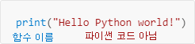
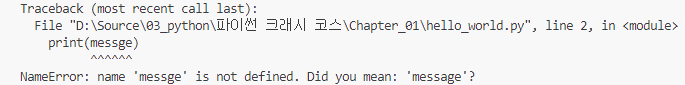

# 2. 변수와 단순한 데이터 타입
변수에 정보를 할당하는 방법, 
텍스트와 숫자 값을 다루는 방법을 배웁니다.

## hello_world.py를 실행할 때 일어나는 일
``` python
print("Hello Python world!")
```
위 코드를 실행하면 아래와 같은 순서로 동작합니다.

1. 에디터가 **파이썬 인터프리터**를 실행한다.
2. **파이썬 인터프리터**가 파이썬 프로그램을 읽고, 프로그램의 각 단어가 어떤 의미인지 파악합니다.<br>
hello_world.py의 경우는 **print()** 함수 괄호 안에 내용(**Hello Python world!**)을 화면에 출력합니다. 
<br>
<br>

에디터로 프로그램을 작성하는 동안 에디터는 프로그램의 여러 부분을 다양한 방식으로 구분합니다.<br>
<br>
**print()** 가 함수 이름임을 인식하고 단어를 눈에 띄는 색깔로 표시하고,<br>
**"Hello Python world!"** 가 파이썬 코드가 아니라는 사실을 인식하고, 함수와 다른 색깔로 표시합니다.<br><br>
이런 기능을 **문법 강조(syntax highlighting)** 라고 부릅니다. 


## 변수
```python
message = "Hello Python world!"
print(message)

Hello Python world!
```
코드에 message라는 **변수**를 추가했습니다. 변수는 **값**과 연결됩니다.<br>
여기서 값은 **"Hello Python world!"** 라는 텍스트 입니다.<br>

```python
message = "Hello Python world!"
print(message)

message = "Hello Python Crash Course world!"
print(message)

Hello Python world!
Hello Python Crash Course world!
```

**변수**의 **값**은 언제든 바꿀 수 있습니다. 파이썬은 항상 **변수**의 **현재 값**을 추적합니다.

## 변수 이름 짓기
- 변수 이름에는 문자, 숫자 밑줄만 사용할 수 있습니다.
- 변수 이름에는 공백을 쓸 수 없습니다. 공백 대신 밑줄 사용
- 파이썬 키워드와 내장 함수 이름을 변수 이름으로 사용할 수 없습니다.
- 변수 이름은 짧으면서도 의미가 분명해야 합니다.
- 소문자 l은 숫자1, 대문자0은 숫자 0과 혼동하기 쉬우므로 주의해야 합니다.
- 대문자에는 특별한 의미가 있으므로 변수에는 소문자만 사용해야 합니다.

## 에러 피하기
```python
message = "Hello Python world!"
print(messge) 
```

프로그램이 성공적으로 실행되지 않을 때는 **트레이스백**을 표시합니다.<br>
<br>

**트레이스백**을 분석해보면, 2행에서 에러가 발생하였고 **messge**가 정의되지 않은 변수 이름 이라는걸 알 수 있으며<br> 
동시에 **message**라는 변수 이름을 사용하려 했는지 제안을 해주기도 합니다.

## 문자열
**문자열(string)** 은 연속적인 문자입니다.<br>
문자열을 만들 때는 다음과 같이 큰따옴표 또는 작은 따옴표를 쓸 수 있습니다.
```
"This is a string."
'This is also string.'
```

## 메서드
```python
name = "ada lovelace"
print(name.title())
```

**메서드(method)** 는 파이썬이 데이터에서 수행할 수 있는 동작입니다.<br>
**name.title()** 에서 **name** 뒤에 있는 점(.)은 **title()** 메서드를 실행하라는 의미입니다.

## 문자열을 사용하는 방법
    title() : 문자열의 각 단어 첫 글자를 대문자로 변경
    upper() : 문자열 전체를 대문자로 변경
    lower() : 문자열 전체를 소문자로 변경

```python
name = "ada lovelace"

print(name.title())
print(name.upper())
print(name.lower())

Ada Lovelace
ADA LOVELACE
ada lovelace
``` 

## f-문자열
```python
first_name  = "ada"
last_name   = "lovelace"
full_name   = f"{first_name} {last_name}"
meesage     = f"Hello, {full_name.title()}!"

print(f"Hello, {full_name.title()}!")
print(message)


Hello, Ada Lovelace!
Hello, Ada Lovelace!
```

**f-문자열**은 따옴표 바로 앞에 **f(format)** 를 쓰고 사용할 변수 이름을 **{ }** 로 묶습니다. <br>

f-문자열을 변수와 함께 사용해서 조합할 수 있고,<br>
f-문자열을 사용해 조합한 결과를 변수에 할당할 수 있습니다.

## 탭이나 줄바꿈으로 문자열에 공백 추가하기
```python
>>> print("Python")
Python

>>> print("\tPython")
    Python

>>> print("Languages:\nPython\nC\nJavaScript")
Languages:
Python
C
JavaScript

>>> print("Languages:\n\tPython\n\tC\n\tJavaScript")
Languages:
    Python
    C
    JavaScript
```
탭을 추가할때는 **\t** 문자를 사용합니다.<br>
줄바꿈을 추가할 때는  **\n** 문자를 사용합니다.<br>
문자열 하나 안에 탭과 줄바꿈을 모두 쓸 수도 있습니다.

## 공백 없애기
```python
>>> favorite_language = ' python '
>>> favorite_language
' python '
>>> favorite_language.rstrip()
' python'
>>> favorite_language.lstrip()
'python '
>>> favorite_language.strip()
'python'
>>> favorite_language
' python '
>>> favorite_language = favorite_language.strip()
>>> favorite_language
'python'
```

**rstrip(), lstrip(), strip()** 메서드를 통해 문자열 값의 공백을 제거할 수 있다.<br>
하지만 변수의 값이 바뀌는것 이 아닌 **메서드**에서 값을 반환할때 공백을 제거해 주는 것

## 접두사 없애기
```python
>>> nostarch_url = 'https://nostarch.com'
>>> nostarch_url.removeprefix('https://')
'nostarch.com'
```
**removeprefix()** 메서드를 통해 문자열의 접두사를 제거할 수 있다.<br>
마찬가지로 변수의 값이 바뀌는 것이 아닌 **메서드**에서 값을 반환할때 접두사를 제거해 주는 것

## 문자열의 문법 에러 피하기
```python
message = 'One of Python's strengths is its diverse community.'
print(message)
```
```
SyntaxError: unterminated string literal (detected at line 1)
```

위와 같은 오류는 **종료되지 않은 문자 리터럴이 존재한다.** 라는 뜻이다.<br>
**One of Python**까지 문자열로 인식하고 그 뒤에 문자열 리터럴이 제대로 닫히지 않았기 때문에 발생하는 오류이다.

## 정수
```python
>>> 2 + 3
5
>>> 3 - 2
1
>>> 2 * 3
6
>>> 3 / 2
1.5
>>> 3 ** 2
9
>>> 2 + 3 * 4
14
>>> (2 + 3) * 4
20
```
**( )** 를 통해, 계산 순서를 바꿀 수 있습니다.

## 부동 수소점 숫자
```python
>>> 0.1 + 0.1
0.2
>>> 0.2 + 0.2
0.4
>>> 2 * 0.1
0.2
>>> 2 * 0.2
0.4
>>> 0.2 + 0.1
0.3000000000000000004
>>> 3 * 0.1
0.3000000000000000004
```
**부동 소수점 숫자**는 소수점이 있는 숫자를 모두를 말합니다.<br>
**부동 소수점 숫자**는 소수점의 위치와 상관없이 숫자가 정상적으로 동작합니다.<br>
간혹, 마지막 처럼 이상한 결과가 나오지만 이후에 처리하는 방법에 대해 배울 예정

## 정수와 부동 소수점 숫자
```python
>>> 4 / 2
2.0
>>> 1 + 2.0
3.0
```
파이썬에서는, **정수**로 나눗셈을 하더라도 결과는 **부동 소수점 숫자** 입니다.<br>
또한 정수와 부동 소수점으로 연산하였을때 결과도 **부동 소수점 숫자**입니다.<br>

## 숫자의 밑줄
```python
>>> universe_age = 14_000_000_000
>>> print(universe_age)
14000000000
```
아주 큰 숫자를 사용할 때 밑줄을 써서 읽기 쉽게 만들수 있습니다.<br>
정수를 할당할 때 밑줄을 사용하더라도 출력 시에는 밑줄이 출력되지 않습니다.<br>
(exampe) 1000 == 1_000 = 10_00

## 다중 할당
```python
>>> x, y, z = 0, 0, 0
```
코드의 한 행에서 여러 변수에 값을 할당할 수 있습니다.<br>
변수 이름과 값을 **,(콤마)** 로 구분합니다. 

## 상수
```python
MAX_CONNECTIONS = 5000
```
**상수**는 프로그램이 실행되는 동한 값을 유지하는 변수입니다.<br>
파이썬은 **공식적으로** 상수를 지원하지 않지만, 절대 변하지 않는 변수를 사용할 때 이름을 전부 **대문자**로 사용합니다.

## 주석
```python
# Say hello to everyone.
print("Hello Python people!")
```
파이썬에서 주석은 **해시 기호(#)** 를 사용합니다.<br>
주석을 사용하는 이유는, 코드가 어떻게 동작하는지, 어떻게 사용하는지 설명하는 용도로 사용합니다.<br>
**주석은 항상, 명확하고 간결하게**
