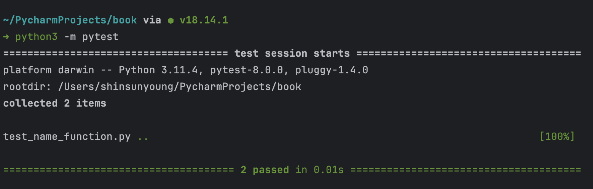

# 11. 코드 테스트

# 1. pip로 pytest 설치하기

```bash
$ python3 -m pip install --upgrade pip
$ python3 -m pip install --user pytest
```

# 2. 함수 테스트

```python
# name_function.py
def get_formatted_name(first, last, middle=''):
    """Generate a neatly formatted full name."""
    if middle:
        full_name = f"{first} {middle} {last}"
    else:
        full_name = f"{first} {last}"
    return full_name.title()

# names.py
from name_function import get_formatted_name

print("Enter 'q' at any time to quit.")
while True:
    first = input("\nPlease give me a first name: ")
    if first == 'q':
        break
    last = input("Please give me a last name: ")
    if last == 'q':
        break

    formatted_name = get_formatted_name(first, last)
    print(f"\tNeatly formatted name: {formatted_name}.")
```

이 함수는 사용자의 이름, 성을 입력하고 생성된 실제 이름을 확인한다.

이걸 테스트 하는 코드를 작성해야 한다.

- 단위 테스트: 함수의 동작 방식 확인
- 테스트 케이스: 함수가 처리해야 하는 상황 전체 중 테스트 완료된 단윝 ㅔ스트
- 전체 커버리지: 모든 상황의 테스트 케이스가 통과함

만약 이 함수를 단위 테스트로 작성하고 싶으면 아래와 같이 코드를 작성한다.

```python
# test_name_function
from name_function import get_formatted_name

def test_first_last_name():
    """'Janis Joplin' 같은 이름으로 작동하는지 검증"""
    formatted_name = get_formatted_name('janis', 'joplin')
    assert formatted_name == 'Janis Joplin'

def test_first_last_middle_name():
    """'Wolfgang Amadeus Mozart'같은 이름으로 작동하는지 검증"""
    formatted_name = get_formatted_name(
        'wolfgang', 'mozart', 'amadeus')
    assert formatted_name == 'Wolfgang Amadeus Mozart'
```

- `test_`  로 시작하는 함수는 테스트라고 인식함
- `assert` 는 조건에 대한 단언임

```bash
$ python3 -m pytest
```



이렇게 나오면 성공했다는 것!

실패하면 아래처럼 나온다. 실패 원인을 분석하고 테스트 케이스가 깨지는 것을 수정하면 된다.


# 3. 클래스 테스트

- `assert a == b` : a와 b가 같다
- `assert a != b` : a와 b가 다르다
- `assert a` : a는 True이다
- `assert not a` : a는 False이다
- `assert element in list` : element가 리스트에 있다
- `assert element not in list` : element가 리스트에 없다

클래스 테스트도 비슷하다.

그냥 단순 메서드 호출이 아닌 클래스를 직접 생성해 비교한다는 것의 차이다.

단, 클래스를 사용할 때 **픽스처**를 사용할 수 있다.

이걸 사용하면 테스트 환경을 만드는 데 도움이 된다. 둘 이상의 테스트에서 리소스 하나를 공유할 수 있기 때문이다.

`@pytest.fixture` 데코레이터를 사용해 함수를 정의하면 된다.

```python
# test_survet.py
import pytest
from survey import AnonymousSurvey

@pytest.fixture
def language_survey():
    """A survey that will be available to all test functions."""
    question = "What language did you first learn to speak?"
    language_survey = AnonymousSurvey(question)
    return language_survey

def test_store_single_response(language_survey):
    """Test that a single response is stored properly."""
    language_survey.store_response('English')
    assert 'English' in language_survey.responses

def test_store_three_responses(language_survey):
    """Test that three individual responses are stored properly."""
    responses = ['English', 'Spanish', 'Mandarin']
    for response in responses:
        language_survey.store_response(response)

    for response in responses:
        assert response in language_survey.responses
```

이렇게 되면 `language_survey()` 를 매개변수로 받게 되면 자동으로 픽스처를 실행하고 반환 값을 테스트 함수에 전달한다.